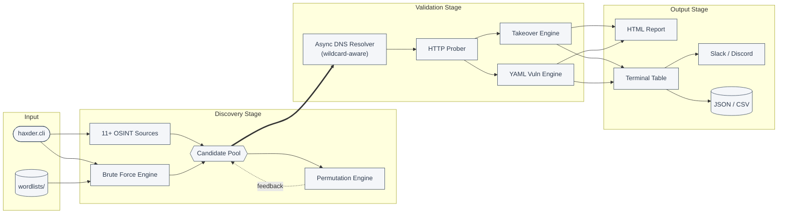

<div align="center">
  <h1>HaXder v0.3.0 Enterprise Edition</h1>
  <p><b>Async Passive Subdomain Discovery, Active Brute-Forcing & Attack Surface Management Toolkit</b></p>
  <p><i>Built for Red Teamers, Penetration Testers, and Enterprise Security Teams</i></p>

  [](https://www.python.org/)
  [](https://opensource.org/licenses/MIT)
  []()
</div>

---

**HaXder** maps a domain's exposed surface by combining passive OSINT collection with active validation. It pulls candidate hostnames from a dozen-plus public and premium data sources, expands that list with dictionary brute-forcing and permutation guessing, then runs every candidate through async DNS resolution with wildcard awareness so what comes out the other end is a short list of real, reachable hosts rather than a wall of noise.

**Author & Lead Developer:** **Hayder Rzaigui**

---

## Key Features

- **Async-First Engine:** Runs on `asyncio` + `aiohttp` and comfortably sustains 500+ concurrent connections during a scan.
- **Wide OSINT Footprint:** Queries 11+ data sources — `Shodan`, `VirusTotal`, `ProjectDiscovery Chaos`, `BufferOver`, `crt.sh`, `HackerTarget`, `AlienVault OTX`, `CertSpotter`, `URLScan`, `Anubis`, `SecurityTrails`, and the `WaybackMachine`.
- **Master/Worker Distribution:** Run one Master node plus any number of Worker nodes on separate hosts to spread a large scan across machines.
- **Wayback Crawling + JS Secret Scanning:** Pulls historical URLs out of the Wayback Machine and inspects fetched JavaScript for leaked keys or tokens.
- **SPF/DMARC Auditing:** Flags weak or missing email-auth DNS records that open the door to spoofing.
- **YAML Vulnerability Templates:** Runs lightweight, user-defined YAML checks against live targets to catch common misconfigurations.
- **Takeover Risk Detection:** Matches CNAME chains and response fingerprints against a local signature set to surface dangling-DNS **takeover risk** (S3, GitHub Pages, Heroku, and others).
- **Interactive HTML Reporting:** Outputs a self-contained dark-themed report with charts, sortable tables, and a vulnerability summary.
- **Webhook/SIEM Notifications:** Ships structured JSON scan telemetry to **Slack**, **Discord**, or a generic SIEM webhook.
- **Built-In HTTP Prober:** Hits every resolved host to capture status code, page title, and missing security headers (CSP, HSTS, X-Frame-Options).
- **Readable CLI Output:** Terminal UI powered by `rich` — clean tables, no emoji noise.

---

## Architecture



---

## Installation

**1. Grab the source:**
Pull the repository down into whatever working directory you use for tooling.

**2. Install requirements:**
Everything HaXder depends on is pinned in `requirements.txt`:
```bash
pip install -r requirements.txt
```

**3. (Optional) Install in editable mode:**
Useful if you want a bare `haxder` command instead of always typing `python -m`:
```bash
pip install -e .
```

---

## Usage

Give HaXder a domain and a few flags — the rest runs on its own.

```bash
python -m haxder.cli -T target.com --brute --permute --http-check --alert
```

### Command-Line Arguments

| Flag | Long Argument | Description | Default |
| :--- | :--- | :--- | :--- |
| `-T` | `--target` | Target base domain (e.g., `tesla.com`) | **Required*** |
| | `--as-number` | Target ASN (e.g., `AS15169`) to discover associated domains | `None` |
| | `--ip-range` | Target CIDR (e.g., `104.16.0.0/24`) to discover associated domains | `None` |
| | `--bounty-scope` | Target bug bounty program (e.g., `yahoo`) to fetch in-scope domains | `None` |
| `-C` | `--concurrency` | Number of concurrent async connections for DNS resolution | `500` |
| `-O` | `--save` | Output file path to save results (e.g., `results.json`) | `None` |
| `-F` | `--stdout-format` | Stdout display format (`table`, `jsonl`) — independent of `-O`'s file format | `table` |
| `-K` | `--conf` | Path to YAML config file containing API keys | `config.yaml` |
| `-R` | `--resolver-file` | Path to text file containing custom DNS resolvers | `resolvers.txt` |
| | `--refresh-resolvers` | Download the latest trusted resolver list | `False` |
| `-V` | `--debug` | Enable detailed debug logging for troubleshooting | `False` |
| | `--skip-resolve`| Skip the DNS validation phase and return all discovered subdomains | `False` |
| | `--brute`| Enable Active Dictionary Brute Forcing | `False` |
| `-D` | `--dict-file` | Path to custom wordlist for brute forcing | `wordlists/subdomains.txt` |
| | `--permute` | Enable Permutation Engine to discover hidden environments | `False` |
| | `--http-check` | Enable active HTTP probing (Status Code & Title) | `False` |
| | `--check-takeover` | Enable Subdomain Takeover Vulnerability Engine | `False` |
| | `--alert` | Send completion notification via configured webhooks (Slack/Discord) | `False` |

\* Required unless `--as-number`, `--ip-range`, or `--bounty-scope` is supplied instead.

### Example Commands

**Everything on — bruteforce, probing, URL/secret extraction, takeover and vuln checks, HTML report:**
```bash
python -m haxder.cli -T example.com --brute --http-check --harvest --check-takeover --vuln-scan --html-report report.html
```

**Distributed run (one Master, one or more Workers):**
```bash
# Master host: serves the Web GUI and accepts Worker submissions
python -m haxder.cli --master-mode --gui-port 8000

# Worker host: scans and pushes results back to the Master
python -m haxder.cli -T example.com --worker-of http://master_ip:8000
```

**High-concurrency scan, results written to JSON:**
```bash
python -m haxder.cli -T example.com -C 1000 -O results.json
```

---

## Configuration & API Keys

Copy `config.yaml.example` to `config.yaml` and drop in your API keys to unlock the premium sources. Any key that's missing or invalid is skipped silently — the rest of the scan keeps going.

Premium sources and notification channels supported out of the box:
- **SecurityTrails**, **Shodan**, **VirusTotal**, **ProjectDiscovery Chaos**
- **Slack** & **Discord** webhooks

---

<div align="center">
  <b>Developed by Hayder Rzaigui</b> <br>
  <i>Tooling built by a practitioner, for practitioners</i>
</div>
